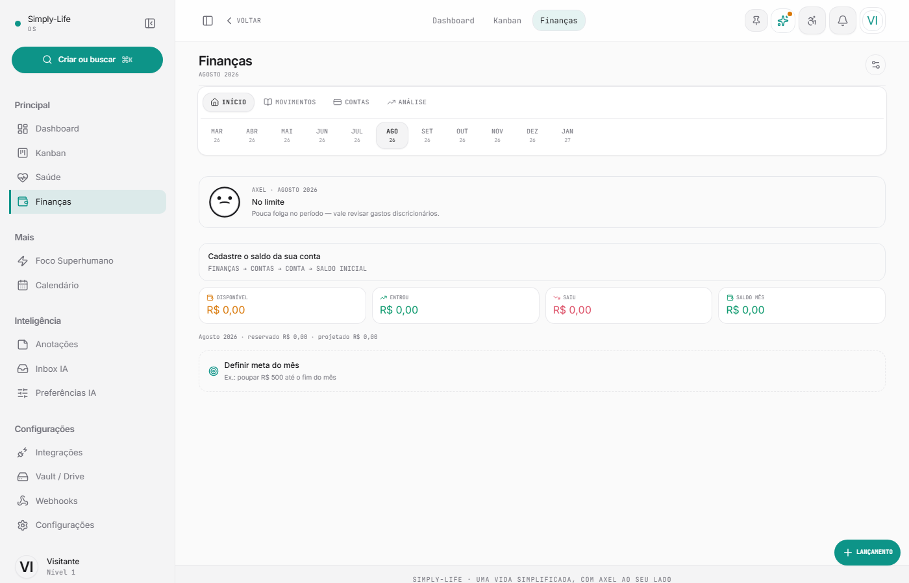

<h1 align="center">Simply-Life OS</h1>

<p align="center">
  <strong>Sistema operacional pessoal com o AXEL no centro — priorização automática, explicada, que você pode sobrescrever.</strong>
</p>

<p align="center">
  <a href="https://simply-life.vercel.app/login"><strong>Ver demo ao vivo</strong></a>
  · na tela de login use <strong>Ver demo</strong> (workspace de exemplo; os dados reiniciam)
</p>

<p align="center">
  <a href="https://github.com/MarianaPlauska/simply-life/actions/workflows/ci.yml"></a>
  
  
  
  
  
</p>

Simply-Life une **tarefas, finanças e saúde** num único app (PWA). O AXEL dá a cada demanda um **score 0–100 com motivo em português**, coloca no horizonte Hoje / Semana / Backlog e **respeita** quando você arrasta o card — o ajuste grava no banco e entra no histórico.

---

## Galeria

<p align="center">
  
</p>
<p align="center"><em>Dashboard · comando do dia, bem-estar e métricas</em></p>

<br />

<p align="center">
  
</p>
<p align="center"><em>Centro de Execução · AXEL organiza, você executa</em></p>

<br />

<p align="center">
  
</p>
<p align="center"><em>Finanças · 50/30/20, contas e lançamentos</em></p>

---

## O que o produto faz

| Módulo | Para quê |
|--------|----------|
| **Kanban / execução** | Fila Hoje, Semana e Backlog; foco absoluto; override manual persistido |
| **AXEL** | Score + razão; orquestração de carga; histórico em `/axel/historico` |
| **Finanças** | 50/30/20, contas, cartões, metas do mês |
| **Saúde** | Hidratação, proteína, humor, medicamentos |
| **E-mail grátis** | IMAP + senha de app do Gmail → tarefa (sem Google Cloud OAuth) |
| **PWA** | Instalar na tela inicial, atalho Rotina Guiada, push (VAPID) |
| **Resumo semanal** | Digest no cron diário — e-mail da conta IMAP e/ou push |

---

## Como foi construído

```
Frontend (Vite + React 19)  →  Supabase (Auth, Postgres + RLS, Realtime)
                            →  Vercel Serverless /api  (IA Groq, IMAP, push, crons)
```

- **RLS** `user_id = auth.uid()` em todas as tabelas de usuário — a demo é só mais um UUID.
- **IA no servidor** — `GROQ_API_KEY` nunca vai no bundle.
- **Um cron Hobby** (`/api/cron/daily` às 09:00 UTC) — Gmail, push, reset da demo e digest semanal no mesmo job.

Referência de engenharia: [`docs/SISTEMA_REFERENCIA.md`](docs/SISTEMA_REFERENCIA.md).

---

## Como rodar

Node 20+, projeto [Supabase](https://supabase.com). Groq é opcional (priorização local se a chave faltar).

```bash
git clone https://github.com/MarianaPlauska/simply-life.git
cd simply-life/frontend
npm install
cp .env.example .env   # VITE_SUPABASE_URL e VITE_SUPABASE_ANON_KEY
npm run dev            # http://localhost:5173
```

APIs + frontend na mesma origem (raiz do repo):

```bash
cp .env.example .env.local   # GROQ_API_KEY, SUPABASE_SERVICE_ROLE_KEY, ENCRYPTION_KEY
npx vercel login
npm run dev                  # vercel dev
```

Deploy: [`docs/DEPLOY_VERCEL.md`](docs/DEPLOY_VERCEL.md). Demo: [`docs/DEMO.md`](docs/DEMO.md). E-mail grátis: [`docs/SETUP_EMAIL_GRATIS.md`](docs/SETUP_EMAIL_GRATIS.md). PWA: [`docs/PWA.md`](docs/PWA.md).

---

## Segurança

RLS por usuário, 2FA TOTP **opt-in**, senha IMAP cifrada (AES-256-GCM), rate limit nas APIs Vercel. **Sem Open Finance.** E-mail só com IMAP/SMTP gratuito.

---

## Roadmap

- [x] Kanban com horizonte persistido e histórico AXEL
- [x] PWA (tema unificado, Rotina Guiada, push de teste)
- [x] Ingestão Gmail via IMAP (pasta opcional, sem OAuth Cloud)
- [x] Resumo semanal no cron diário
- [ ] Provisionar a conta demo em produção (`VITE_DEMO_*` + migration 047)
- [ ] OAuth Gmail/Calendar da Google Cloud **não** é a aposta — o caminho grátis é senha de app

---

<p align="center">
  <sub>Feito por <a href="https://github.com/MarianaPlauska">Mariana Plauska</a></sub>
</p>
