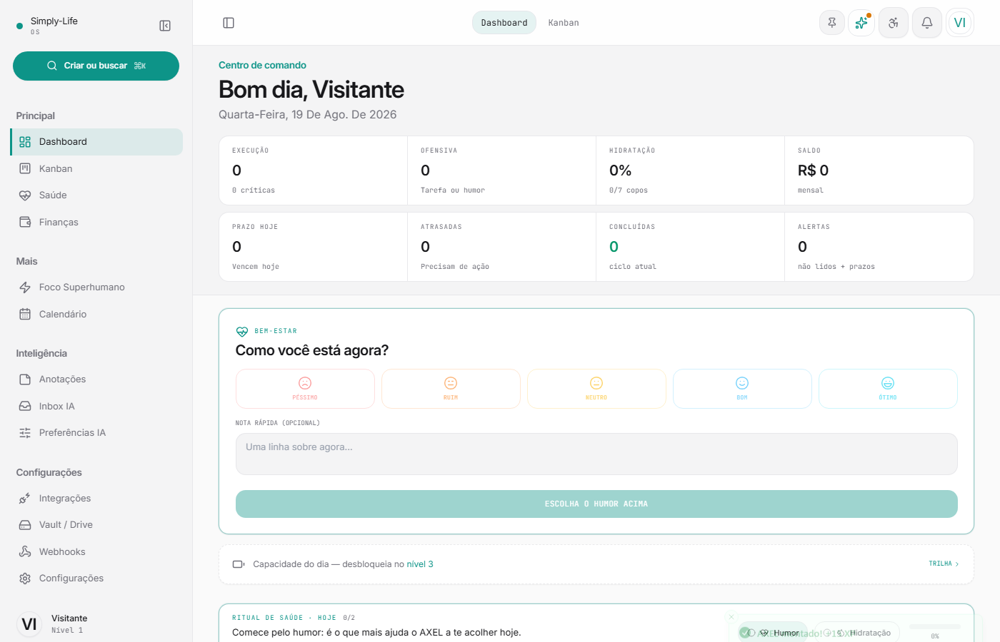
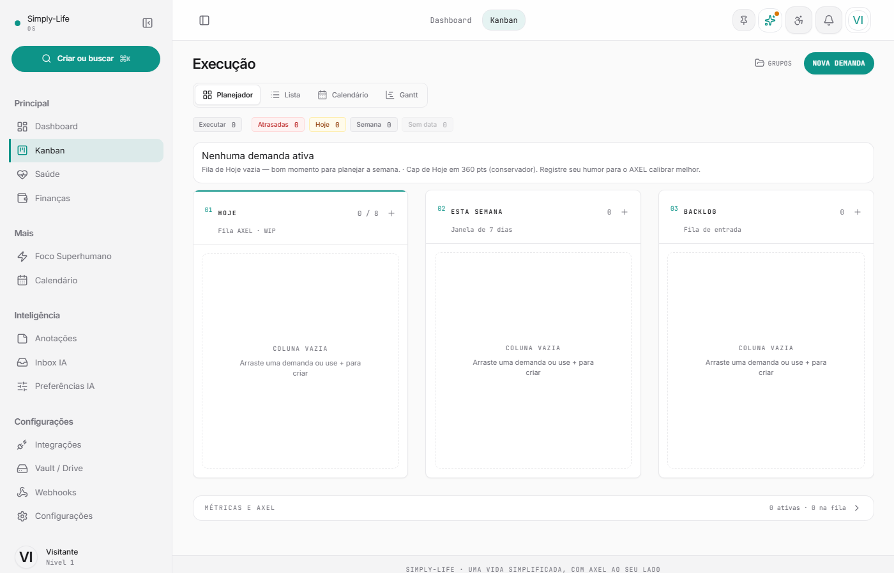

<h1 align="center">Simply-Life OS</h1>

<p align="center">
  <strong>Assistente executivo pessoal — AXEL organiza, você executa.</strong>
</p>

<p align="center">
  
  
  
  
  
  
</p>

---

## Galeria

<p align="center">
  
</p>

<p align="center">
  <em>Dashboard · pilares de vida, finanças e métricas</em>
</p>

<br />

<p align="center">
  
</p>

<p align="center">
  <em>Centro de Execução · AXEL organiza, você executa</em>
</p>

> **Imagens:** coloque `dashboard.png` e `kanban.png` em [`docs/images/`](docs/images/).  
> Envie as capturas no chat ou faça commit — o GitHub exibe automaticamente nesta seção.

---

## O que é

Simply-Life não é um gerenciador de tarefas passivo. É um **sistema operacional de vida** com o **AXEL** no centro — **A**poio · aceleração (**X**) · **E**xecução · **L**og: um assistente que **prioriza automaticamente**, explica cada decisão e respeita quando você ajusta manualmente.

O produto une **execução** (Kanban), **finanças** (50/30/20), **saúde**, **foco** e **gamificação** — tudo conversando entre si (XP, streaks, carga mental, ingestão de demandas externas).

> **AXEL define prioridades · você arrasta se discordar · tudo fica registrado no log.**

---

## Destaques

| Área | O que faz |
|------|-----------|
| **Centro de Execução** (`/kanban`) | Painel Hoje + planejamento (Semana / Backlog), drag-and-drop, foco absoluto |
| **AXEL IA** | Priorização em lote via Groq (Llama 3.3) — score 0–100 + razão em português |
| **Orquestração automática** | Ao abrir o Kanban, ao mudar tarefas ou ao chegar webhook — reorganiza sozinho |
| **Transparência** | Razão da IA na fila Hoje, log “O que o AXEL decidiu”, resumo matinal |
| **Ingestão** | Webhook + realtime — nova demanda entra e o pipeline recalcula em segundos |
| **Regras locais** | Cap de carga mental, decay de tarefas paradas, dependências (`blockedBy`) |
| **Dashboard** | Visão holística: pilares de vida, finanças, saúde, métricas diárias |
| **Design Instrumento** | Paleta quente, acento cobre, tipografia editorial — denso e profissional |

---

## Arquitetura

```
┌──────────────────────────────────────────────────────────┐
│  Frontend — React 19 + Vite + TypeScript + Tailwind      │
│  Zustand (slices) · dnd-kit · Recharts · TipTap          │
└────────────────────────────┬─────────────────────────────┘
                             │
         ┌───────────────────┼───────────────────┐
         ▼                   ▼                   ▼
   Supabase Auth      PostgreSQL + RLS     Realtime channels
   (sessão)           (tarefas, finanças…)   (sync entre abas)
         │                   │
         └───────────────────┘
                             │
┌────────────────────────────┴─────────────────────────────┐
│  Vercel Serverless — /api/*                                │
│  orchestrate-tasks · webhook-ingest · generate-greeting …  │
│  GROQ_API_KEY no servidor (priorização IA)                 │
└────────────────────────────────────────────────────────────┘
```

**Decisões-chave**

- **Supabase** — auth, dados multi-tenant com RLS (`user_id = auth.uid()`)
- **APIs Vercel** — IA e webhooks no servidor (chaves nunca no browser em produção)
- **UI otimista** — feedback imediato, sync em background
- **Pipeline AXEL** — score → horizonte (Hoje/Semana/Backlog) → cap de carga → log explicável

Documentação interna: [`docs/SISTEMA_REFERENCIA.md`](docs/SISTEMA_REFERENCIA.md) · [`docs/DESIGN_SYSTEM.md`](docs/DESIGN_SYSTEM.md)

---

## Stack

| Camada | Tecnologia |
|--------|------------|
| UI | React 19, React Router 7, Tailwind 3 |
| Estado | Zustand (slices modulares) |
| Dados | Supabase (Auth, Postgres, Realtime, RPC) |
| IA | Groq (Llama 3.3 70B) via `api/orchestrate-tasks` |
| Deploy | Vercel (frontend + serverless) |
| Testes | Vitest, Testing Library, Playwright E2E |

---

## Como rodar

### Pré-requisitos

- Node.js 20+
- Projeto [Supabase](https://supabase.com)
- (Opcional) Conta [Groq](https://console.groq.com) — priorização IA grátis, sem cartão

### 1. Frontend

```bash
git clone https://github.com/MarianaPlauska/simply-life.git
cd simply-life/frontend
npm install
cp .env.example .env
# VITE_SUPABASE_URL e VITE_SUPABASE_ANON_KEY
npm run dev
```

App em `http://localhost:5173`.

### 2. APIs locais (recomendado para Kanban + IA)

Na **raiz** do repositório:

```bash
cp .env.example .env.local
# GROQ_API_KEY=gsk_...
npx vercel login   # primeira vez
npm run dev        # vercel dev — frontend + /api na mesma origem
```

Testar orquestração:

```bash
npm run test:groq
```

### 3. Produção (Vercel)

Guia completo: [`docs/DEPLOY_VERCEL.md`](docs/DEPLOY_VERCEL.md) (reconectar Git, Deploy Hook, settings corretos).

Variáveis no painel Vercel:

| Variável | Onde |
|----------|------|
| `VITE_SUPABASE_URL` | Build / env |
| `VITE_SUPABASE_ANON_KEY` | Build / env |
| `GROQ_API_KEY` | Server only |
| `SUPABASE_SERVICE_ROLE_KEY` | Server only (webhooks) |

---

## Estrutura do repositório

```
simply-life/
├── frontend/src/
│   ├── components/
│   │   ├── kanban/       # Centro de Execução (KanbanView, drawer AXEL)
│   │   ├── dashboard/    # Command center holístico
│   │   ├── Finance/      # 50/30/20, transações
│   │   ├── Health/       # Hábitos, treino, nutrição
│   │   └── layout/       # Shell, sidebar, header AXEL
│   ├── hooks/            # Orquestração, ingestão, execução
│   ├── lib/              # urgencyEngine, orchestratePipeline, decay…
│   └── store/slices/     # Zustand por domínio
├── api/                  # Serverless Vercel (IA, webhooks)
├── docs/                 # Design system, referência do sistema
└── e2e/                  # Playwright
```

---

## AXEL — fluxo de priorização

1. **Entrada** — tarefa manual, webhook ou sync Supabase
2. **Score** — Groq analisa título, descrição, remetente, tags, prazo (fallback: motor local)
3. **Horizonte** — Hoje (≥90 ou vence hoje) · Semana · Backlog
4. **Carga** — excesso em Hoje adia para Semana (cap configurável em pts)
5. **Decay** — tarefas paradas há dias perdem score e vão ao Backlog
6. **Log** — cada decisão visível na UI; drag manual é respeitado

---

## Segurança

- Autenticação Supabase (email/senha)
- RLS em todas as tabelas de usuário
- Chaves de IA e service role **apenas** no servidor Vercel
- Webhooks com validação de assinatura (`api/_lib/webhookAuth.js`)

---

## Roadmap

- [x] Supabase Auth + CRUD + Realtime
- [x] Centro de Execução (Kanban AXEL + orquestração automática)
- [x] IA Groq no servidor (priorização em lote)
- [x] Design system Instrumento (dashboard + Kanban)
- [x] Ingestão webhook + reorganização automática
- [ ] Foco absoluto — migração visual completa
- [ ] Pin “fixar em Hoje” (AXEL não move)
- [ ] Google Calendar / Gmail (OAuth)
- [ ] PWA offline robusto
- [ ] App mobile (React Native / Expo)

---

## Contribuição

Projeto **privado** — uso pessoal. Issues e sugestões são bem-vindas via GitHub.

---

<p align="center">
  <sub>Feito por <a href="https://github.com/MarianaPlauska">Mariana Plauska</a></sub>
</p>
