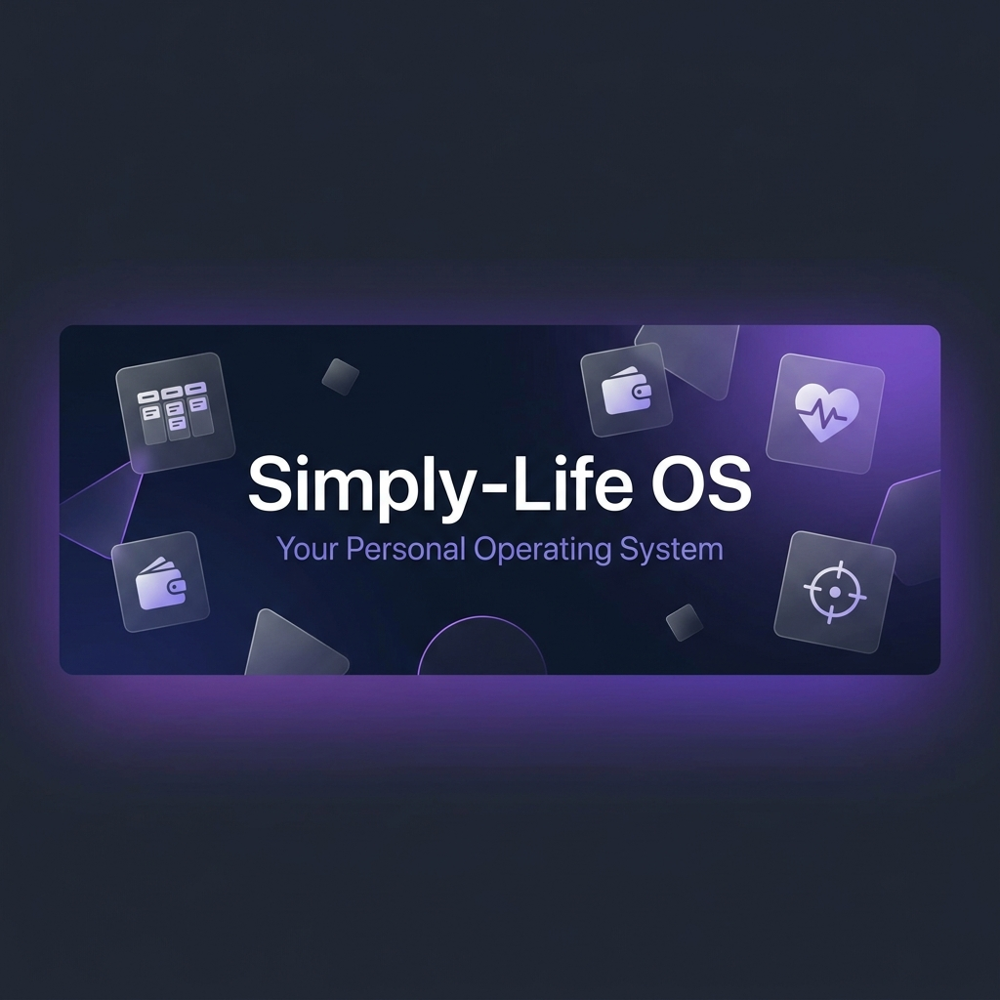

<p align="center">
  
</p>

<h1 align="center">Simply-Life OS</h1>

<p align="center">
  <strong>Seu Sistema Operacional Pessoal — Produtividade, Finanças e Bem-estar em um só lugar.</strong>
</p>

<p align="center">
  
  
  
  
  
  
</p>

---

## ✨ O que é o Simply-Life?

Simply-Life não é um gerenciador de tarefas — é um **Sistema Operacional de Vida**. Ele orquestra suas tarefas, finanças, hábitos de saúde e sessões de foco em um dashboard único e inteligente. Cada módulo conversa com os outros: concluir tarefas gera XP, sessões de foco alimentam seu streak, e o registro de humor se correlaciona com seus hábitos.

<br/>

## 🧩 Módulos

| Módulo | Descrição |
|--------|-----------|
| **📋 Kanban Board** | Gestão de tarefas com drag-and-drop, labels, subtarefas, prioridades, templates e ações em lote |
| **🧠 Motor de Triagem IA** | Sistema de pontuação por palavras-chave (0–150) que prioriza tarefas automaticamente |
| **💰 Controle Financeiro** | Acompanhamento de despesas com framework 50/30/20, categorias e gráficos de tendência |
| **💊 Saúde & Hábitos** | Lembretes de medicação, rastreador de hábitos com streaks e metas de hidratação |
| **🧘 Bem-estar Mental** | Rastreador de humor, diário com prompts diários e revisão semanal |
| **🎯 Modo Foco** | Timer Pomodoro com recompensa de XP, streaks e sistema de gamificação |
| **📊 Relatórios** | Relatórios semanais/mensais com tendências de tarefas, foco e eficiência |
| **📝 Segundo Cérebro** | Notas com editor rich-text (TipTap), categorias, busca e fixação |
| **🔔 Notificações** | Alertas inteligentes com pontuação de urgência e controles por módulo |

<br/>

## 🏗️ Arquitetura

```
┌─────────────────────────────────────────────┐
│              Simply-Life OS                 │
│                                             │
│  React 19 + TypeScript + Tailwind + Zustand │
│                    ▼                        │
│            Supabase Client (JS)             │
│         ┌──────────┼──────────┐             │
│         ▼          ▼          ▼             │
│     Auth      PostgreSQL   Realtime         │
│   (Sessão)     (RLS)     (Channels)         │
│         └──────────┼──────────┘             │
│                    ▼                        │
│         Funções RPC (PL/pgSQL)              │
│    dashboard_resumo · finalizar_sessao_foco │
└─────────────────────────────────────────────┘
```

**Decisões-chave:**
- **100% Serverless** — Sem servidor backend. O Supabase cuida de auth, banco e realtime.
- **Row Level Security** — Toda tabela exige `user_id = auth.uid()`. Zero vazamento horizontal.
- **UI Otimista** — Estado atualiza instantaneamente, depois sincroniza com o Supabase.
- **Sync em Tempo Real** — Canal Postgres Changes mantém tarefas sincronizadas entre abas.

<br/>

## 🛠️ Stack Tecnológica

| Camada | Tecnologia |
|--------|-----------|
| **Framework UI** | React 19, React Router 7 |
| **Linguagem** | TypeScript 6.0 |
| **Estilização** | Tailwind CSS 3.4 |
| **Estado** | Zustand 5 (14 slices, persistidos) |
| **Backend** | Supabase (Auth + PostgreSQL + Realtime + RPC) |
| **Editor** | TipTap 3 (notas rich-text) |
| **Gráficos** | Recharts 3 |
| **Drag & Drop** | dnd-kit (kanban + reordenação de subtarefas) |
| **Animações** | Framer Motion 12 |
| **Ícones** | Lucide React |
| **Build** | Vite 8, pronto para PWA |
| **Testes** | Vitest + Testing Library + Playwright E2E |
| **Deploy** | Vercel (frontend) + Supabase Cloud (backend) |

<br/>

## 🚀 Como Rodar

### Pré-requisitos
- Node.js 20+
- Um projeto Supabase ([supabase.com](https://supabase.com))

### Configuração

```bash
# clonar
git clone https://github.com/MarianaPlauska/simply-life.git
cd simply-life/frontend

# instalar dependências
npm install

# configurar variáveis de ambiente
cp .env.example .env
# edite o .env com suas credenciais do Supabase:
#   VITE_SUPABASE_URL=https://seu-projeto.supabase.co
#   VITE_SUPABASE_ANON_KEY=sua-anon-key

# rodar
npm run dev
```

O app estará disponível em `http://localhost:5173`.

<br/>

## 📂 Estrutura do Projeto

```
frontend/
├── src/
│   ├── components/
│   │   ├── Auth/          # Login, callback do Google OAuth
│   │   ├── Anotacoes/     # Segundo Cérebro (notas)
│   │   ├── Calendar/      # Integração com Google Calendar
│   │   ├── Finance/       # Controle financeiro & orçamentos
│   │   ├── Health/        # Hábitos, medicamentos, humor, diário
│   │   ├── Onboarding/    # Experiência de primeiro uso
│   │   ├── Relatorios/    # Analytics & relatórios
│   │   ├── Settings/      # Preferências & integrações
│   │   ├── dashboard/     # Dashboard principal
│   │   ├── kanban/        # Quadro de tarefas & modal de detalhes
│   │   ├── layout/        # Sidebar, header, shell
│   │   └── ui/            # Componentes UI reutilizáveis
│   ├── hooks/             # useRealtimeSync, hooks customizados
│   ├── lib/               # Cliente Supabase
│   ├── store/
│   │   ├── slices/        # 14 slices Zustand (auth, tarefas, foco, ...)
│   │   ├── useTaskStore.ts # Store combinada
│   │   └── storeTypes.ts  # Definições de tipos compartilhados
│   ├── constants/         # Config do Kanban, tokens de tema
│   ├── utils/             # Helpers de data, formatadores
│   └── types.ts           # Tipos TypeScript globais
```

<br/>

## 🗄️ Esquema do Banco

22 tabelas com RLS ativado, incluindo:

| Tabela | Finalidade |
|--------|-----------|
| `profiles` | Perfil do usuário, XP, streak, última sessão |
| `tarefas_unificadas` | Tarefas com prioridade, status, origem, soft-delete |
| `subtarefas` | Itens de checklist por tarefa |
| `labels` / `tarefa_labels` | Sistema de tags (muitos-para-muitos) |
| `sessoes_foco` | Sessões Pomodoro vinculadas a tarefas |
| `despesas` | Despesas com categoria e status de pagamento |
| `habitos_diarios` | Hábitos diários com metas e progresso |
| `diario_humor` | Registros de humor diário (escala 1-5 + emoji) |
| `entradas_diario` | Entradas de diário com prompts |
| `palavras_chave` | Palavras-chave da triagem IA com peso |
| `notificacoes` | Notificações inteligentes com urgência |

<br/>

## 🔐 Segurança

- **Autenticação** — Supabase Auth com email/senha (Google OAuth planejado)
- **Persistência de Sessão** — Automática via `supabase.auth.onAuthStateChange`
- **Row Level Security** — Aplicado em todas as 22 tabelas
- **Sem Servidor Backend** — Zero superfície de ataque de APIs customizadas

<br/>

## 📍 Roadmap

- [x] Migração completa para Supabase (Auth + CRUD + Realtime)
- [x] Sistema de gamificação (XP, streaks, níveis)
- [x] Módulo de analytics & relatórios
- [x] Bem-estar mental (humor + diário)
- [ ] Integração Google Calendar via OAuth
- [ ] Sincronização Gmail via Edge Functions
- [ ] Revisão semanal com IA (Edge Function)
- [ ] PWA com suporte offline
- [ ] App mobile (React Native / Expo)

<br/>

---

<p align="center">
  <sub>Feito com 💜 por <a href="https://github.com/MarianaPlauska">Mariana Plauska</a></sub>
</p>
