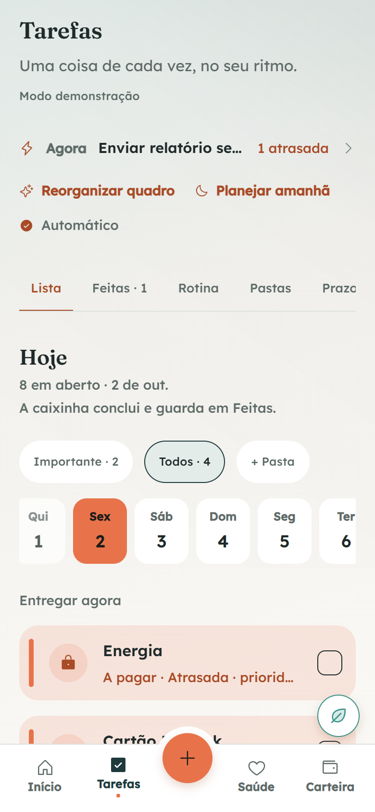
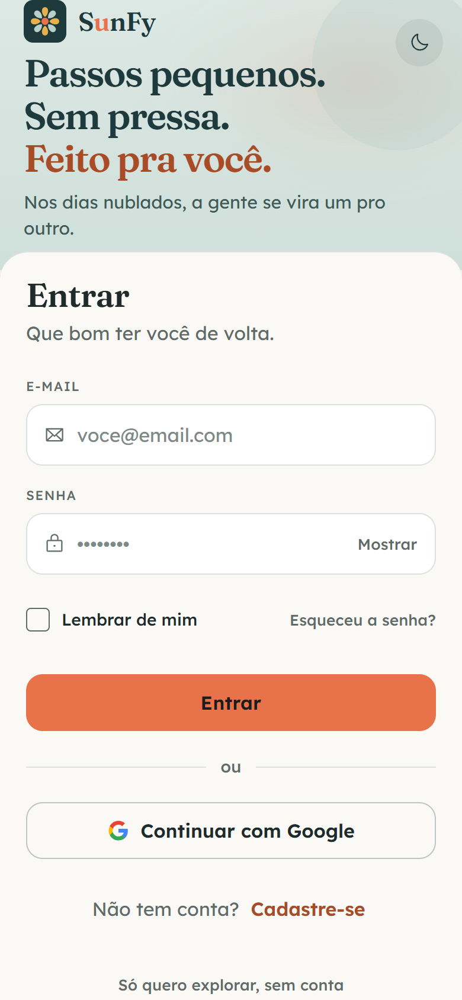
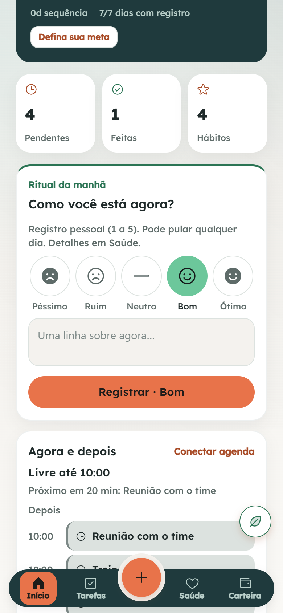
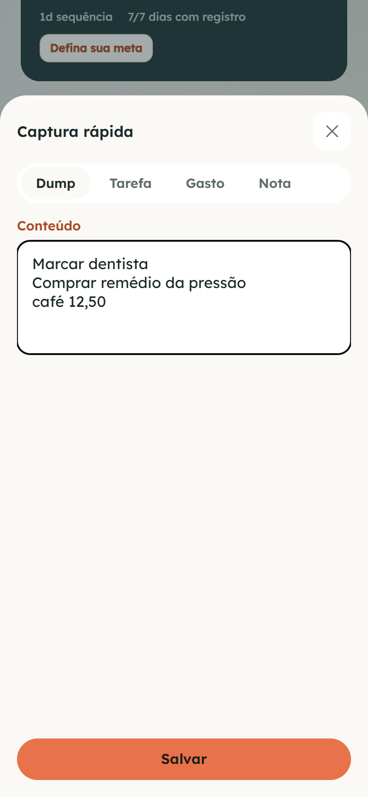
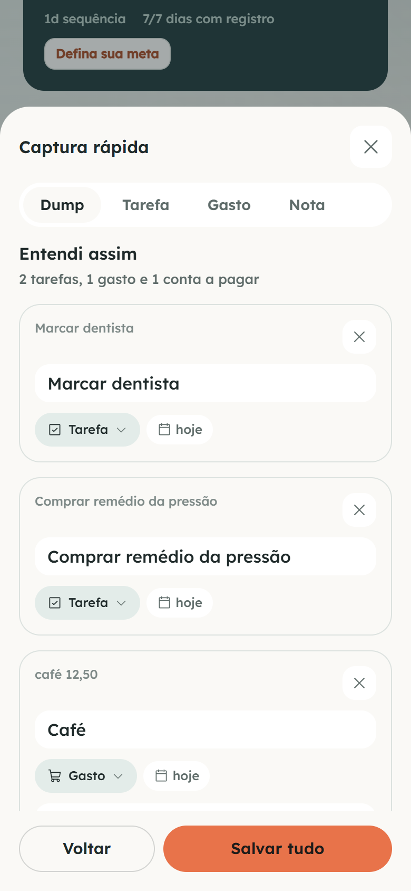
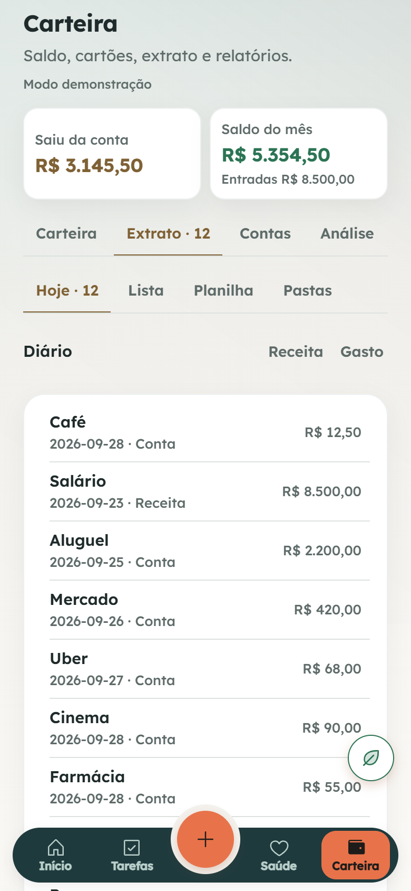

<h1 align="center">Simply Life</h1>

<p align="center">
  Um app para organizar o dia sem pressão.<br />
  Tarefas, humor, saúde e dinheiro no mesmo lugar.
</p>

<p align="center">
  <a href="https://simply-life.vercel.app/login"><strong>Experimentar agora</strong></a><br />
  <sub>Na tela de entrada, toque em <strong>Continuar como convidado</strong>. Você vê o app com dados de exemplo e não precisa criar conta.</sub>
</p>

<p align="center">
  
  
  
</p>

## Por que eu criei esse app

Muita gente vive com ansiedade, depressão ou TDAH e tenta se organizar com apps de produtividade comuns. Na prática, esses apps costumam piorar as coisas. Mandam notificação o tempo todo, cobram sequência de dias, mostram listas enormes e fazem a pessoa se sentir culpada quando não dá conta.

O Simply Life foi pensado para o dia difícil, não para o dia perfeito. A ideia é simples:

* **Um passo de cada vez.** O app mostra o que importa agora, e não a lista inteira de uma vez.
* **Sem castigo.** Se você passar dias sem abrir, nada é perdido e ninguém te cobra.
* **Tudo junto.** Tarefa, humor, remédio, água, conta para pagar. É tudo parte do mesmo dia, então fica tudo na mesma tela.
* **Uma ajuda que explica.** O Axel, o assistente do app, sugere a ordem das tarefas e diz o porquê. Se você discordar, é só mudar. A escolha final é sempre sua.

> O Simply Life ajuda a organizar a rotina. Ele não faz diagnóstico e não substitui terapia ou médico. Se você estiver em crise, ligue para o CVV no **188**, de graça, a qualquer hora.

## O que dá para fazer

| Parte do app | Para que serve |
|---|---|
| **Início** | Ver como está o dia, quanto você já fez e registrar como está se sentindo |
| **Tarefas** | Listar o que precisa fazer, separar por dia e quebrar tarefas grandes em passos pequenos |
| **Saúde** | Diário de humor, água, proteína, sono, remédios e exercícios de respiração para momentos de aperto |
| **Carteira** | Saldo, cartões, contas a pagar e quanto deve sobrar no fim do mês |
| **Calendário** | Ver o mês inteiro e ligar sua agenda do Google, Outlook ou Teams |

<p align="center">
  
  
</p>

## Como funciona na prática

Imagine uma manhã corrida. Você abre o app e em menos de um minuto faz isto:

<table>
  <tr>
    <td align="center" width="50%">
      <br />
      <strong>1. Diz como está</strong><br />
      Um toque na carinha e pronto. Se quiser, escreve uma linha sobre o momento.
    </td>
    <td align="center" width="50%">
      <br />
      <strong>2. Tira da cabeça</strong><br />
      Toca no botão <strong>+</strong> e escreve tudo que está martelando, uma coisa por linha. Não precisa escolher categoria nem data.
    </td>
  </tr>
  <tr>
    <td align="center" width="50%">
      <br />
      <strong>3. Confere o que o app entendeu</strong><br />
      O app separa sozinho o que é tarefa, lembrete, gasto, dinheiro que entrou e conta a pagar. Se algo ficou errado, é só tocar e trocar antes de salvar.
    </td>
    <td align="center" width="50%">
      <br />
      <strong>4. O Axel organiza o dia</strong><br />
      As tarefas entram nos horários livres, entre os compromissos que você já tinha. Na hora certa, o Axel mostra o que fazer e oferece um timer para começar.
    </td>
  </tr>
  <tr>
    <td align="center" width="50%">
      <br />
      <strong>5. O dinheiro vai para a carteira</strong><br />
      O "café 12,50" virou um gasto e o "pagar a vitória 8,11" virou uma conta a pagar. O saldo do mês já foi atualizado.
    </td>
    <td align="left" width="50%">
      <strong>Alguns jeitos de escrever que o app entende</strong><br /><br />
      <code>dentista amanhã 9h</code> vira tarefa com dia e hora<br />
      <code>ligar pro João às 15h</code> vira tarefa, e não gasto de 15<br />
      <code>me lembra do remédio às 22h</code> vira lembrete com aviso<br />
      <code>uber 23</code> ou <code>gastei 50 no mercado</code> vira gasto<br />
      <code>recebi 500 do freela</code> vira dinheiro que entrou<br />
      <code>colar 44,50 vence dia 11</code> vira conta a pagar
    </td>
  </tr>
</table>

Os prints acima são do app de verdade, no modo convidado, e não montagens.

## Instalar no celular Android (APK)

O Simply Life é um app nativo de Android, não um site dentro de uma moldura. Ele é instalado por um arquivo **APK**, como qualquer outro app baixado fora da loja.

**Para instalar:**

1. Abra no celular o link do APK e baixe o arquivo.
2. Toque no arquivo baixado. Se o Android perguntar, permita instalar apps dessa fonte.
3. Toque em **Instalar** e depois em **Abrir**.
4. Entre com sua conta ou toque em **Continuar como convidado**.

Com as atualizações automáticas ligadas (o EAS Update, explicado no guia abaixo), o app recebe as telas novas pela internet e não precisa ser reinstalado. Só é preciso baixar um APK novo quando muda algo mais profundo do app.

**Para gerar o APK** (para quem cuida do código):

```bash
cd apps/mobile
npx eas-cli login
npx eas-cli init              # só na primeira vez
npx eas-cli build -p android --profile preview
```

O build roda na nuvem da Expo e leva uns 15 minutos. No fim aparece um link e um QR code para baixar o APK. O passo a passo completo está em [`docs/MOBILE_INSTALADOR.md`](docs/MOBILE_INSTALADOR.md).

No iPhone, por enquanto, o app funciona pelo navegador ou pelo Expo Go.

## Com o que ele foi feito

Para quem tem curiosidade sobre a parte técnica:

* **TypeScript** é a linguagem principal. Todo o app que você vê na tela foi escrito nela.
* **React Native com Expo** faz o mesmo código rodar no celular e no navegador.
* **JavaScript (Node.js)** roda no servidor, na Vercel. É ali que ficam a inteligência do Axel, a leitura de e-mails e as notificações.
* **SQL** no **Supabase**, que guarda os dados e cuida do login. Cada pessoa só enxerga os próprios dados.
* **Python (FastAPI)** aparece na pasta `backend`, com parte da lógica de priorização.
* **Groq** e **Gemini** são os modelos de IA que ajudam o Axel a entender e ordenar as tarefas.

A identidade visual usa as cores petróleo e coral, as fontes Fraunces e Lexend e os ícones Phosphor. As cores foram escolhidas para passar calma e deixar o texto fácil de ler.

## Como rodar no seu computador

Você vai precisar do [Node.js](https://nodejs.org) versão 20 ou mais nova e de um projeto gratuito no [Supabase](https://supabase.com).

```bash
git clone https://github.com/MarianaPlauska/simply-life.git
cd simply-life
npm install
cp apps/mobile/.env.example apps/mobile/.env
```

Abra o arquivo `apps/mobile/.env` e preencha `EXPO_PUBLIC_SUPABASE_URL` e `EXPO_PUBLIC_SUPABASE_ANON_KEY` com os dados do seu Supabase. Depois:

```bash
npm run mobile:web   # abre no navegador em http://localhost:8082
npm run mobile       # abre o QR code para testar no celular com o Expo Go
```

Se quiser só olhar, não precisa configurar nada. Use o botão **Continuar como convidado**.

Mais detalhes para quem vai publicar ou mexer no servidor estão na pasta [`docs`](docs), por exemplo [`DEPLOY_VERCEL.md`](docs/DEPLOY_VERCEL.md) e [`SISTEMA_REFERENCIA.md`](docs/SISTEMA_REFERENCIA.md).

## Segurança e privacidade

* Cada conta só acessa os próprios dados. Isso é garantido pelo banco, não só pela tela.
* Dá para ligar a verificação em duas etapas no perfil.
* Senhas de e-mail ficam guardadas com criptografia.
* O app não se conecta ao seu banco. Os valores da carteira são os que você mesmo anota.

## Atualizar os prints

As imagens deste README saem direto do app. Com o app rodando no navegador, execute:

```bash
node scripts/readme-shots.mjs   # telas principais
node scripts/readme-flow.mjs    # passo a passo de uso
```

<p align="center">
  <sub>Feito por <a href="https://github.com/MarianaPlauska">Mariana Plauska</a></sub>
</p>
